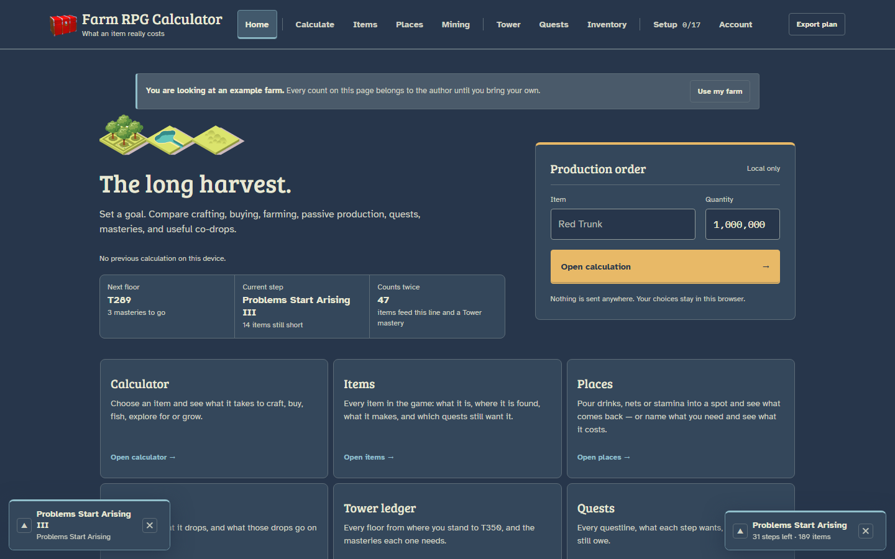
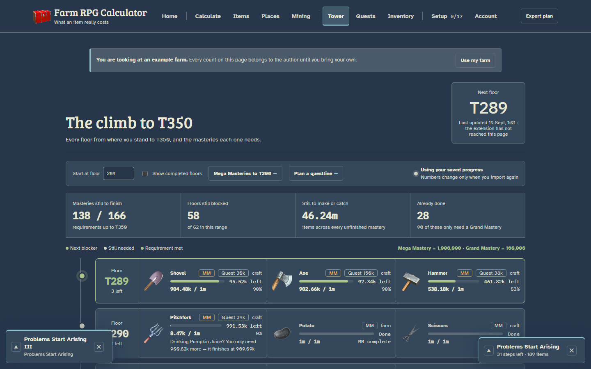
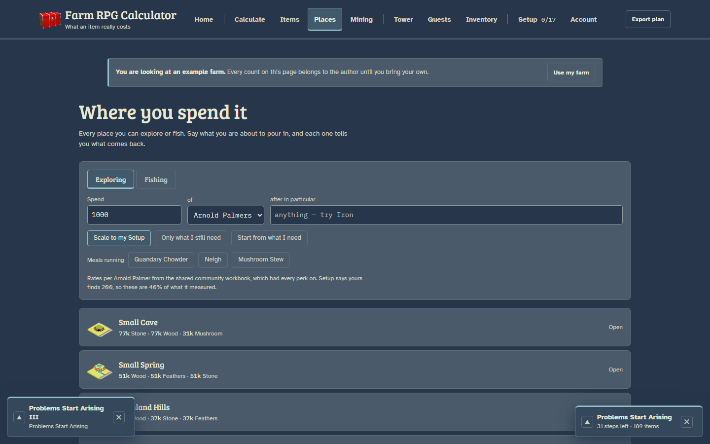

<p align="center">
  
</p>

<h1 align="center">Farm RPG Calculator</h1>

<p align="center">
  <b>What does an item actually cost you?</b><br>
  A planner for endgame <a href="https://farmrpg.com">Farm RPG</a> — Grand Masteries, Mega Masteries, the Tower and long questlines.
</p>

<p align="center">
  <a href="https://alikdash1.github.io/Farmrpgcalculator/"><b>Open the planner</b></a>
  &nbsp;·&nbsp;
  <a href="https://alikdash1.github.io/Farmrpgcalculator/downloads/farm-rpg-account-sync.zip"><b>Download the extension</b></a>
  &nbsp;·&nbsp;
  <a href="#bring-your-own-farm">Set it up</a>
</p>

<p align="center">
  
</p>

Silver is the wrong measure at the endgame. What you actually spend is
**stamina, Arnold Palmers, Apple Cider, Large Nets and days of farm output** —
and the cheapest route depends on which of those you have. This planner prices
everything in the currency you really spend, and it knows that one trip clears a
place's whole drop table, so the items that ride along cost nothing.

## What's inside

| | |
|---|---|
| **Calculate** | Pick an item and a quantity. Crafting, buying, exploring, fishing and farm production compared per ingredient, with the 1.45 craft yield counted at every level. |
| **Places** | Every exploring and fishing spot in the game's own order. Say what you are pouring in and see what comes back — or name what you need and see what it costs. |
| **Tower** | Every floor from where you stand to T350 and the masteries each one needs, scored against the right goal: 100,000 for a Grand Mastery, 1,000,000 for a Mega. |
| **Quests** | 2,479 quests in 569 questlines, with renamed lines stitched back into one chain. Plan a whole line: what to farm, where, and what the same trip brings home. |
| **Items** | Every item: where it drops, what it makes, which quests and masteries still want it. |
| **Mining** | Every mine, what it drops, and what those drops go on to make. |
| **Inventory** | Your own bag, checked against the questline you are tracking. |

<p align="center">
  
  
</p>

## Bring your own farm

The planner opens with **the author's farm as an example**, and says so on
every page. To see your own numbers, add the account sync extension. It is
read-only: it reads the Farm RPG pages you open, and hands what it finds to the
planner inside your own browser.

1. **[Download the extension](https://alikdash1.github.io/Farmrpgcalculator/downloads/farm-rpg-account-sync.zip)**
   and unzip it somewhere you will keep it.
2. Open `chrome://extensions` (or `brave://extensions`, `edge://extensions`),
   switch on **Developer mode**, choose **Load unpacked**, and pick the
   `farm-rpg-account-sync` folder.
3. Open [the planner](https://alikdash1.github.io/Farmrpgcalculator/) in a tab
   and leave it open.
4. Visit your profile, Inventory, Tower, Mastery, Quests and farm pages in Farm
   RPG once each.

The moment your first capture arrives, the example is dropped completely —
nothing of the author's is mixed into your numbers. The full guide, including
the one permission switch people miss, is on the planner's **Account** page.

**What the extension will never do:** click, play or navigate the game for you;
send anything over the network (it has no network code at all); read passwords,
cookies or session tokens. Everything it captures stays in your browser.

## Run it yourself

There is no build step and no server. Clone it and open `index.html`:

```bash
git clone https://github.com/alikdash1/Farmrpgcalculator.git
```

Item pictures are loaded from farmrpg.com, so they need a connection.

**Hosting your own copy?** The extension only talks to the addresses listed in
its `manifest.json`. Add yours in both places —
`host_permissions` and the second `content_scripts` → `matches` — then reload
the extension. Opening the planner from disk or `localhost` already works.

## Project layout

```
index.html          the whole app, one page
js/                 page scripts — engine.js is the pure costing logic
css/                styles
data/               game data as plain script globals
assets/             fonts, the mark, location art
collectors/         the account sync extension and its importer
downloads/          the packed extension, served from the site
tools/              command-line planners and maintenance scripts
tests/              node --test suites
docs/               briefing, design notes, known mistakes, screenshots
```

## Working on it

Start with [`docs/BRIEFING.md`](docs/BRIEFING.md) — the game, the app, every
file, and the decisions and mistakes already made.

```bash
node --test tests/*.mjs                                      # the test suite
node tools/handoff.mjs check                                 # cache busters, dead references, contrast
powershell -ExecutionPolicy Bypass -File tools/pack-extension.ps1   # rebuild the extension zip
node tools/screenshot.mjs http://localhost:8777 home places tower   # refresh these screenshots
```

Edit a file loaded by `index.html`? Bump its `?v=` — the check will remind you.

## Credit

Game data and item artwork belong to Farm RPG. The complete item list is
derived from [buddy.farm](https://buddy.farm)'s public search index. This is a
fan-made planner, not affiliated with either.

The planner's own code is under the [MIT licence](LICENSE). Bundled fonts —
Bree Serif, Atkinson Hyperlegible and IBM Plex Mono — are under the SIL Open
Font License; their licences are in `assets/fonts/`.
